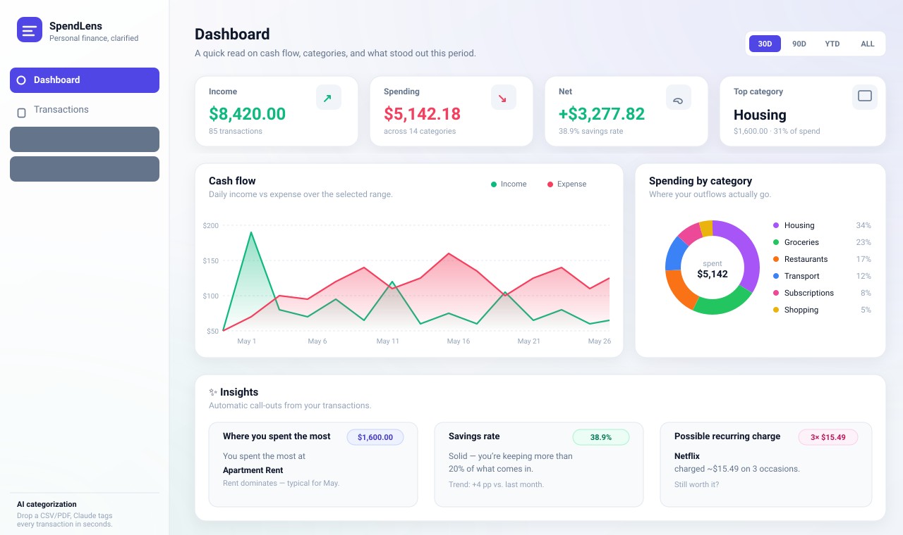
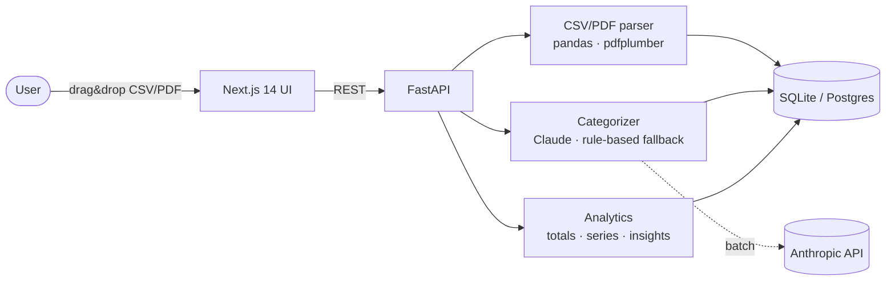

# SpendLens

> Personal finance, clarified. Drop a CSV or PDF bank statement → SpendLens parses every line, asks Claude to categorize it, and turns it into a clean dashboard with cash flow, category breakdown, and automatic insights.

  



## Architecture at a glance



## Why this project

A portfolio piece that touches every layer a hiring manager actually cares about:

- A **REST API** with real domain modeling, not a CRUD demo
- **Data parsing** that copes with messy real-world CSV/PDF exports
- **LLM integration** with a deterministic fallback so the app never breaks offline
- **Charts and analytics** that aren't just "render the data" — they compute totals, shares, savings rate, recurring charges, and biggest line items
- **A real UI** with light/dark variables, drag-and-drop upload, filters, and proper empty/error states
- **Production-shaped infra** — Docker Compose, env-driven config, tests

## Stack

| Layer | Tech |
| --- | --- |
| Backend | FastAPI · SQLAlchemy 2 · Pydantic v2 · SQLite (Postgres-compatible) |
| Parsing | pandas (CSV) · pdfplumber (PDF) · regex fallback |
| AI | Anthropic Claude (`claude-haiku-4-5`) with a rule-based fallback |
| Frontend | Next.js 14 (App Router) · TypeScript · Tailwind · Recharts · lucide-react |
| Infra | Docker · docker-compose |
| Tests | pytest (parser + categorizer) |

## Repo layout

```
spendlens/
├── backend/                 FastAPI service
│   ├── app/
│   │   ├── routers/         transactions, statements, analytics, categories
│   │   ├── services/        parser, categorizer (AI + rules), analytics
│   │   ├── models.py        SQLAlchemy models
│   │   ├── schemas.py       Pydantic API contracts
│   │   ├── database.py      Engine + session factory
│   │   ├── config.py        Settings (pydantic-settings)
│   │   ├── main.py          App factory, lifespan, CORS
│   │   └── seed.py          Demo data seeder
│   ├── tests/
│   ├── requirements.txt
│   └── Dockerfile
├── frontend/                Next.js app
│   ├── app/
│   │   ├── page.tsx         Dashboard
│   │   ├── transactions/    Search, filter, delete
│   │   ├── insights/        Auto-generated narrative insights
│   │   └── upload/          Drag-and-drop CSV / PDF
│   ├── components/          ui/, charts, table, nav, upload zone
│   └── lib/api.ts           Typed API client
├── sample-data/statement.csv
├── docker-compose.yml
└── README.md
```

## Quick start

### Option A — Docker Compose (zero local setup)

```bash
cd spendlens
cp backend/.env.example backend/.env       # optional — fill ANTHROPIC_API_KEY for AI mode
docker compose up --build
```

Open [http://localhost:3000](http://localhost:3000).

### Option B — Run locally

**Backend**

```bash
cd backend
python -m venv .venv && source .venv/bin/activate    # Windows: .venv\Scripts\activate
pip install -r requirements.txt
cp .env.example .env
python -m app.seed                                   # optional — populates demo data
uvicorn app.main:app --reload --port 8000
```

API docs at [http://localhost:8000/docs](http://localhost:8000/docs).

**Frontend**

```bash
cd frontend
npm install
npm run dev
```

UI at [http://localhost:3000](http://localhost:3000).

## Try it out

1. Open the **Upload** page.
2. Drop `sample-data/statement.csv` (or any of your own bank CSV exports).
3. Watch the dashboard fill in: cash flow, category pie, top merchants, savings rate, and recurring charges.

## AI categorization

When `ANTHROPIC_API_KEY` is set, every imported transaction is sent in a single batch to Claude, which returns a category from a fixed taxonomy (Groceries, Restaurants, Transport, Subscriptions, etc.). If the key is missing or the call fails, a deterministic keyword-based classifier takes over — the app keeps working, just with slightly less nuance on edge cases.

The taxonomy lives in `backend/app/services/categorizer.py` and is the single source of truth used for both modes.

## Tests

```bash
cd backend
pip install -r requirements.txt pytest
pytest
```

Covers the CSV parser (US/EU number formats, ISO/dayfirst dates, debit/credit columns, parens-negatives, NaN edge cases), the rule-based categorizer, and the analytics service (totals, breakdown, time-series, insights).

CI runs ruff + pytest for the backend and `tsc --noEmit` + `next build` for the frontend on every push (see `.github/workflows/ci.yml`).

## Convenience targets

```bash
make install     # set up venv + npm deps
make backend     # uvicorn with hot reload
make frontend    # next dev
make seed        # populate the DB with 3 months of demo data
make test        # backend tests
make docker      # spin up the whole thing in containers
```

## Roadmap (nice talking points for interviews)

- Recurring-charge detection with proper period detection (currently amount+merchant grouping)
- User accounts + JWT (single-tenant for now)
- Postgres + Alembic migrations
- Budget goals per category with monthly reset
- Forecast endpoint that uses last N months to project end-of-month spend
- Export to CSV / OFX

## License

MIT.
