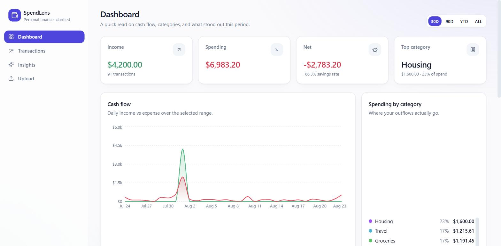
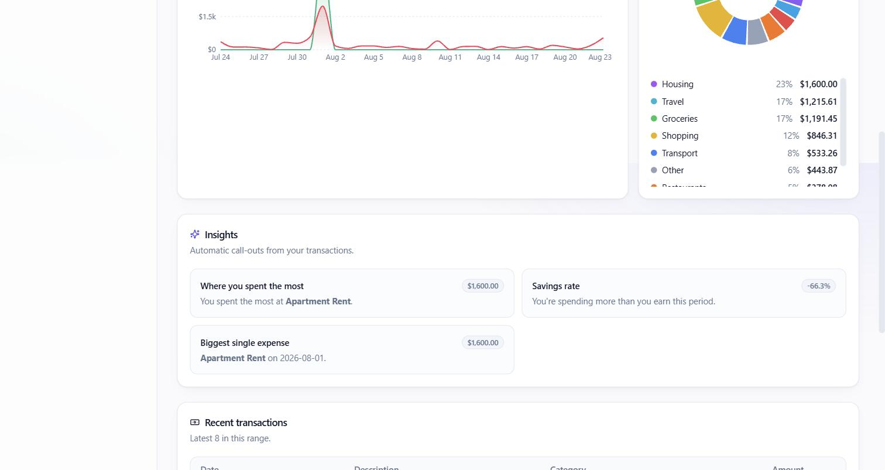
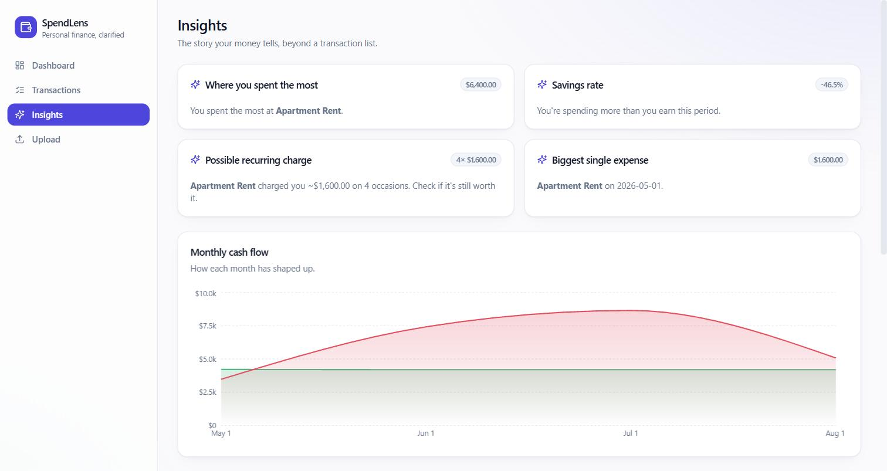
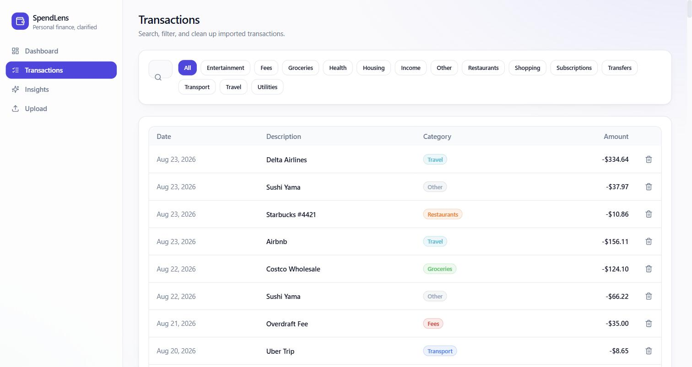
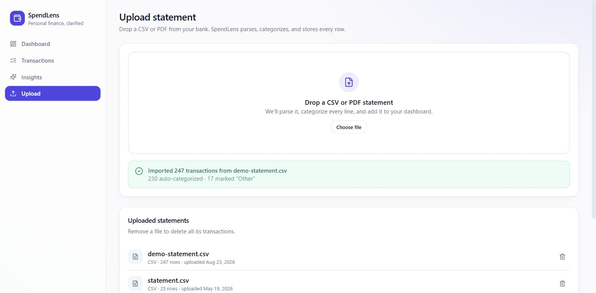
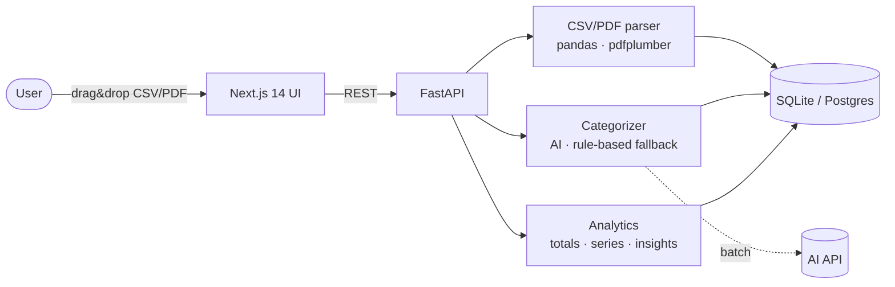

# SpendLens

> Personal finance, clarified. Drop a CSV or PDF bank statement → SpendLens parses every line, uses AI to categorize it, and turns it into a clean dashboard with cash flow, category breakdown, and automatic insights.

  



SpendLens takes the raw, messy export your bank gives you and turns it into something you can actually read: how much came in, how much went out, where it went, and what's worth a second look. Upload a statement, and within seconds every transaction is parsed, categorized, and rolled up into charts and plain-language insights.

---

## Table of contents

- [Features](#features)
- [Screenshots](#screenshots)
- [Architecture at a glance](#architecture-at-a-glance)
- [Stack](#stack)
- [Quick start](#quick-start)
- [How AI categorization works](#how-ai-categorization-works)
- [Repo layout](#repo-layout)
- [Tests & CI](#tests--ci)
- [Convenience targets](#convenience-targets)
- [Roadmap](#roadmap)
- [License](#license)

---

## Features

**📤 Upload any bank statement (CSV or PDF).** Drag-and-drop a file and SpendLens parses it, categorizes every row, and stores it. The CSV parser copes with the real-world mess: US and EU number formats, ISO and day-first dates, single-amount or separate debit/credit columns, parenthesized negatives, and blank cells. PDF statements are read table-first with `pdfplumber`, falling back to regex line parsing when there's no clean table.

**🤖 AI-powered categorization.** Every imported transaction is sent in a single batch to an AI model, which assigns a category from a fixed taxonomy (Groceries, Restaurants, Transport, Subscriptions, Travel, and more). No API key? A deterministic keyword classifier takes over automatically, so the app never breaks — it just loses a little nuance on edge cases.

**📊 A dashboard that actually computes something.** Income, spending, net, and savings rate as headline stats; a daily cash-flow chart; and a spending-by-category donut with per-category share and totals. Switch the time range between 30 days, 90 days, year-to-date, and all-time.

**✨ Automatic insights.** SpendLens reads your transactions and calls out what matters: where you spent the most, your savings rate, likely recurring charges (same merchant, similar amount, more than once), and your single biggest expense — each written as a plain-English sentence, no chart-reading required.

**🔎 Searchable, filterable transactions.** Full-text search across descriptions and merchants, one-click category filters, and inline delete to clean up imports.

**🗂️ Statement management.** Every upload is tracked. Remove a statement and all of its transactions go with it.

---

## Screenshots

### Dashboard — cash flow, categories, and headline numbers


Headline stats (income, spending, net with savings rate, and your top category), a daily cash-flow chart, and a spending-by-category breakdown — all filterable by time range.



The category donut and ranked breakdown show exactly where outflows go, next to auto-generated insight cards.

### Insights — the story behind the numbers



Plain-language call-outs (top merchant, savings rate, recurring charges, biggest single expense) plus a monthly cash-flow view and all-time category ranking.

### Transactions — search, filter, clean up



Search by description or merchant, filter by any category with one click, and delete rows inline. Categories are color-coded to match the charts.

### Upload — drag, drop, done



Drop a CSV or PDF and SpendLens parses, categorizes, and imports it. You get a summary of how many rows were imported and how many were auto-categorized, plus a list of every statement you've uploaded.

---

## Architecture at a glance



A CSV or PDF comes in through the Next.js UI, hits the FastAPI backend, and flows through three services: a **parser** that normalizes messy rows into transactions, a **categorizer** that labels each one (an AI model in a single batch, with a rule-based fallback), and an **analytics** layer that computes totals, time-series, category breakdowns, and insights on demand. Everything is persisted to SQLite (Postgres-compatible).

---

## Stack

| Layer | Tech |
| --- | --- |
| Backend | FastAPI · SQLAlchemy 2 · Pydantic v2 · SQLite (Postgres-compatible) |
| Parsing | pandas (CSV) · pdfplumber (PDF) · regex fallback |
| AI | LLM API (configurable) with a rule-based fallback |
| Frontend | Next.js 14 (App Router) · TypeScript · Tailwind · Recharts · lucide-react |
| Infra | Docker · docker-compose |
| Tests | pytest (parser + categorizer + analytics) · ruff · CI on every push |

---

## Quick start

### Option A — Docker Compose (zero local setup)

```bash
cd spendlens
cp backend/.env.example backend/.env       # optional — add your AI API key for AI mode
docker compose up --build
```

Open **[http://localhost:3000](http://localhost:3000)**. The API is on **[http://localhost:8000](http://localhost:8000)** with interactive docs at **/docs**.

### Option B — Run locally

**Backend**

```bash
cd backend
python -m venv .venv && source .venv/bin/activate    # Windows: .venv\Scripts\activate
pip install -r requirements.txt
cp .env.example .env
python -m app.seed                                   # optional — populates 3 months of demo data
uvicorn app.main:app --reload --port 8000
```

**Frontend**

```bash
cd frontend
npm install
npm run dev
```

UI at [http://localhost:3000](http://localhost:3000), API docs at [http://localhost:8000/docs](http://localhost:8000/docs).

### Try it out

1. Open the **Upload** page.
2. Drop `sample-data/statement.csv` (or any of your own bank CSV exports).
3. Watch the dashboard fill in: cash flow, category pie, top merchants, savings rate, and recurring charges.

Prefer instant data? Run `python -m app.seed` (or `make seed`) to load three months of realistic demo transactions without uploading anything.

---

## How AI categorization works

When an AI API key is set, every imported transaction is sent in a **single batch** to the model, which returns one category per row from a fixed taxonomy. Batching keeps it fast and cheap — one request per upload, not one per transaction.

If the key is missing or the call fails for any reason, a deterministic keyword-based classifier takes over. The app keeps working offline and in tests; it just leans on rules instead of the model. Both modes draw from the **same taxonomy**, defined once in `backend/app/services/categorizer.py`, which is also used to seed the category table. That single source of truth means AI and fallback modes never disagree on what categories exist.

Insights, by contrast, are computed **deterministically** — no AI call on every page load — so the dashboard stays instant and doesn't burn tokens just to re-render.

---

## Repo layout

```
spendlens/
├── backend/                 FastAPI service
│   ├── app/
│   │   ├── routers/         transactions, statements, analytics, categories
│   │   ├── services/        parser, categorizer (AI + rules), analytics
│   │   ├── models.py        SQLAlchemy models
│   │   ├── schemas.py       Pydantic API contracts
│   │   ├── database.py      Engine + session factory
│   │   ├── config.py        Settings (pydantic-settings)
│   │   ├── main.py          App factory, lifespan, CORS
│   │   └── seed.py          Demo data seeder
│   ├── tests/
│   ├── requirements.txt
│   └── Dockerfile
├── frontend/                Next.js app
│   ├── app/
│   │   ├── page.tsx         Dashboard
│   │   ├── transactions/    Search, filter, delete
│   │   ├── insights/        Auto-generated narrative insights
│   │   └── upload/          Drag-and-drop CSV / PDF
│   ├── components/          ui/, charts, table, nav, upload zone
│   └── lib/api.ts           Typed API client
├── sample-data/statement.csv
├── docs/                    Screenshots used in this README
├── docker-compose.yml
└── README.md
```

---

## Tests & CI

```bash
cd backend
pip install -r requirements.txt pytest
pytest
```

Tests cover the CSV parser (US/EU number formats, ISO/day-first dates, debit/credit columns, parens-negatives, NaN edge cases), the rule-based categorizer, and the analytics service (totals, breakdown, time-series, insights).

CI runs `ruff` + `pytest` for the backend and `tsc --noEmit` + `next build` for the frontend on every push — see `.github/workflows/ci.yml`.

---

## Convenience targets

```bash
make install     # set up venv + npm deps
make backend     # uvicorn with hot reload
make frontend    # next dev
make seed        # populate the DB with 3 months of demo data
make test        # backend tests
make docker      # spin up the whole thing in containers
```

---

## Roadmap

- Recurring-charge detection with proper period detection (currently amount + merchant grouping)
- User accounts + JWT (single-tenant for now)
- Postgres + Alembic migrations
- Budget goals per category with monthly reset
- Forecast endpoint that projects end-of-month spend from the last N months
- Export to CSV / OFX

---

## License

MIT — see [LICENSE](LICENSE).
